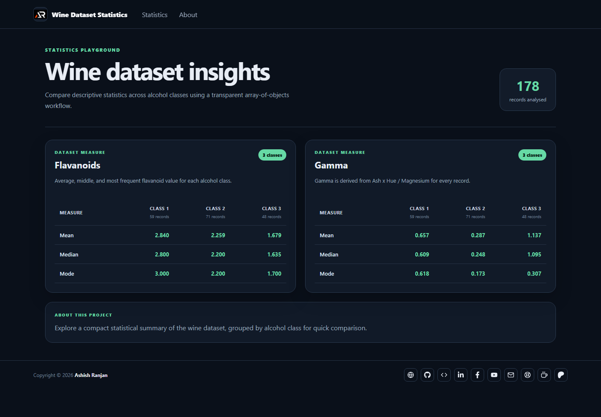

# Wine Dataset Statistics

A React data exploration app that groups wine records by alcohol class and compares mean, median, and mode values for flavanoids and derived gamma measurements.



## Features

- Grouped wine dataset analysis
- Mean, median, and mode comparison tables
- Derived gamma measurement from Ash, Hue, and Magnesium values
- Responsive layout with accessible navigation and local project branding
- GitHub Pages deployment

## Tech stack

React, Create React App, Sass, and React Icons.

## Run locally

```bash
npm install
npm start
```

Create a production build with `npm run build` and deploy with `npm run deploy`.

## Links

- Live: https://a2rp.github.io/calculate-mean-median-mode-from-array-of-objects/
- Repository: https://github.com/a2rp/calculate-mean-median-mode-from-array-of-objects
- Portfolio: https://www.ashishranjan.net/
- GitHub: https://github.com/a2rp
- CodePen: https://codepen.io/ash1198
- LinkedIn: https://www.linkedin.com/in/aashishranjan
- Facebook: https://www.facebook.com/theash.ashish/
- YouTube: https://www.youtube.com/@ashishranjan-ashz?sub_confirmation=1
- Email: mailto:ash.ranjan09@gmail.com

## Support

- Support: https://a2rp-donation-page.netlify.app/
- Buy Me a Coffee: https://buymeacoffee.com/a2rp
- Patreon: https://www.patreon.com/a2rp
